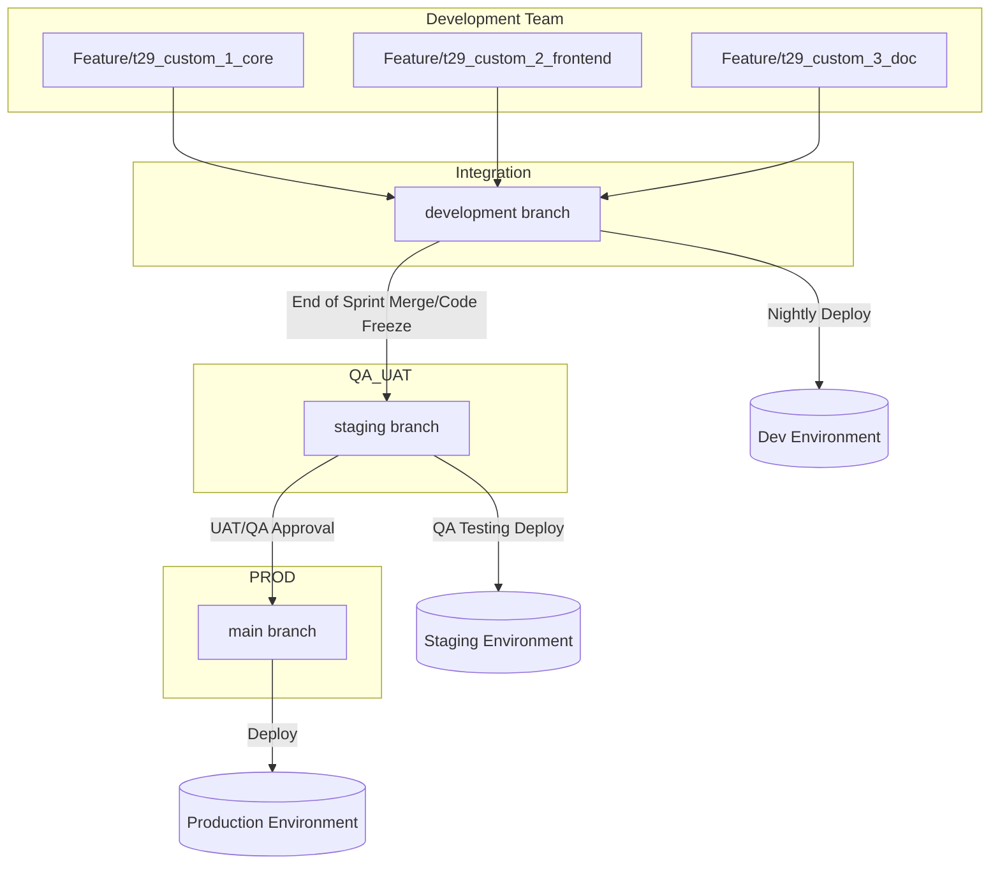
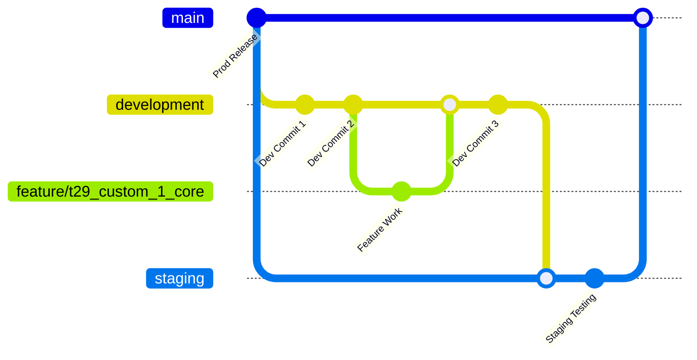
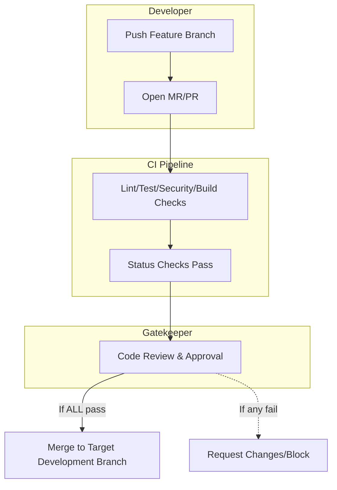

# Odoo Sprint Release Project

## 1. Overview

This project implements a robust release strategy for Odoo, covering the full lifecycle from feature development to production deployment, including nightly builds and CI/CD automation.

---

## 2. Branching & Release Workflow

### Branch Types

- **main**: Stable, production-ready code only.
- **staging**: Pre-production/UAT, mirrors production for QA and UAT.
- **development**: Integrates feature branches, subject to daily/nightly builds.
- **feature/**: Temporary branches for new features or bugfixes.

### Workflow Steps

1. Developers branch from `main` or `development` to `feature/*`.
2. After code review and passing checks, feature branches are merged into `development`.
3. Nightly CI pipeline builds and tests `development`, deploying to the dev environment and tagging each build.
4. At code-freeze/end of sprint, `development` is merged into `staging` for UAT/QA.
5. After approval, `staging` is merged into `main` and deployed to production.

---

## 3. Visual Workflow & Branching

### Release Flow Diagram

### Branching Strategy Diagram

---

## 4. Merge Request (MR) & CI Pipeline

All code changes require a Merge Request (MR/PR) and pass through automated and manual gatekeeping steps:

1. **Open MR:**  
   Developers push changes to a feature/hotfix branch and open a MR targeting `development`.
2. **Automated Checks (CI):**
   - Linting, formatting, and tests (unit/functional)
   - Security scans (SAST, dependencies)
   - Build artifacts
3. **Gatekeeping:**  
   - Code review and approval (per code-owners)
   - All required status checks must pass
   - Branch protection rules as needed
4. **Merge:**  
   Only after all checks and approvals. Post-merge jobs may deploy to preview/dev.

#### Example Pipeline Flow

---

## 5. Environments

| Environment   | Branch        | Purpose                        | Deployment Trigger     |
|---------------|-------------- |------------------------------- |------------------------|
| Development   | `development` | Daily integration, feature QA  | Auto on merge          |
| Staging       | `staging`     | UAT, regression, load tests    | Auto on merge          |
| Production    | `main`        | Customer-facing, stable        | Manual + approval      |

---

## 6. Project Structure

- [**Jenkinsfile**](./Jenkinsfile) — Multibranch Pipeline to build Odoo release and deploy to the required environment
- **addons/** — Custom Odoo modules
- **pyproject.toml** — Manage Python dependencies
- **Dockerfile** - Manage dependencies needed for pipeline build environment.
- **odoo/** — Odoo core modules

#### Custom Modules

- `t29_custom_1` — Base custom module
- `t29_custom_2` — Depends on `t29_custom_1`
- `t29_custom_3` — Depends on `t29_custom_2`

---

## 7. Security, Quality, and Access

- **Security:** Use Jenkins credential store; avoid hardcoded secrets.
- **Quality:** Linting, Scanning, Test coverage, Automated Testsuite runs, code review, and required approvals.
- **Production deployment approval must be performed by Release Managers only.**
    - **Access:** Restrict the Jenkins manual approval step to authorized Release Managers (see `release_managers.yaml`).
    - **Odoo permissions:** Use `ir.model.access.csv` to ensure only Release Managers have the required model access for deployment approval actions within Odoo.

---

## 8. References

- [Odoo Documentation](https://www.odoo.com/documentation/)

---

## 9. Limitations & Open Questions

### Limitations

- Automated rollback only covers Odoo itself — any changes to external systems (like third-party APIs) aren’t reverted automatically if a deployment goes wrong.
- Secure storage of backups and build artifacts is essential, but details and responsibility still need to be clarified.
- The pipeline relies on thorough testing earlier in the process, gaps in test coverage could let bugs slip through.
- Deployment assumes the staging and production environments are very similar.unexpected differences might cause surprises.
- The three custom modules depend on each other, increasing complexity for isolated testing and deployment.
- To ensure safety, human approval is needed before deploying to production, which may slow down releases.

### Open Questions

- Should we consider switching to container based deployments for easier scaling and consistency(e.g using GitOps and Kubernetes)?
- How are secrets (DB passwords, API keys) managed and rotated within the pipeline and servers? Is there a plan to use tools like HashiCorp Vault or something similar?
- Is the current level of automated testing sufficient to catch regressions? How is UAT handled (fully automated, partially manual)?
- Is the current level of monitoring and alerting enough, or do we need deeper observability (logs, traces, KPI metrics)?
- Do we need a more robust plan for disaster recovery and regular backup testing?
- Are there compliance or audit requirements for release traceability and change management?

---

## 10. Future Enhancements and Ideas

- Leverage GitOps and Kubernetes for Odoo deployments:
  - Store all infrastructure and application configurations in Git for traceability and easier rollbacks.
  - Use tools like ArgoCD to automate syncing your Kubernetes cluster state with what's defined in Git.

- Improve observability across the stack:
  - **Logging:** Centralize logs using the ELK stack, Loki, or something similar.
  - **Metrics:** Collect and visualize metrics with Checkmk, Prometheus, and Grafana.
  - **Tests KPI'S** Test report visualization of release cadense.
  - **Alerting:** Set up automated notifications for failures and anomalies to catch issues early.
  - **Tracing:** Implement distributed tracing with Jaeger or OpenTelemetry for better insight into request flow and bottlenecks.

---